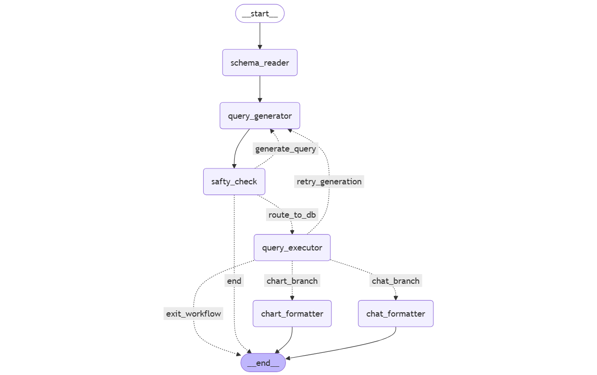

# LangGraph Workflow Architecture

  

<h2>Workflow Diagram</h2>

This diagram illustrates the execution flow of the database query agent, including schema extraction, query generation, execution routing, retry handling, and response formatting.

🚧🚧🚧🚧🚧🚧🚧🚧🚧🚧🚧🚧🚧🚧

# 🏗️Under Development

🚧🚧🚧🚧🚧🚧🚧🚧🚧🚧🚧🚧🚧🚧